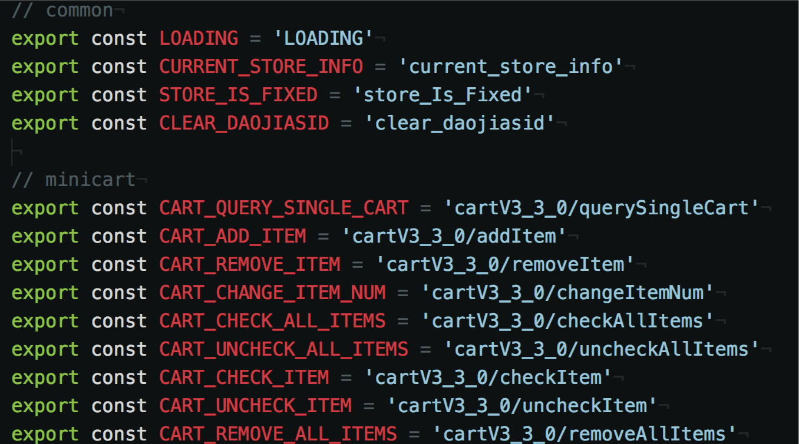
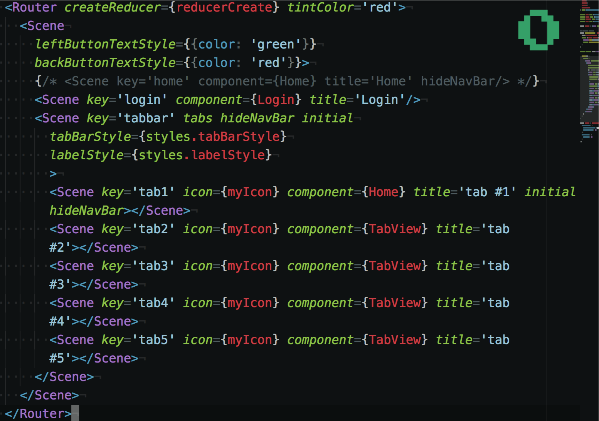

# Daojia-RN
京东到家 React Native 项目。

## 开发环境
```sh
$ npm i -g react-native-cli # 全局安装，只需要安装一次

$ npm install # 安装开发依赖

$ react-native run-ios # mac 环境项目启动

$ npm start # 启动jsBundle
```
## 开发工具
- Atom
- Nuclide
- Xcode

## 代码调试
http://localhost:8081/debugger-ui 浏览器访问链接
## 参考教程
- [https://github.com/jondot/awesome-react-native](https://github.com/jondot/awesome-react-native)
- [http://facebook.github.io/react-native/docs/getting-started.html](http://facebook.github.io/react-native/docs/getting-started.html)
- [http://reactnative.cn/](http://reactnative.cn/)

## 项目框架选型与功能描述
* react-native-router-flux 路由与导航系统：充分利用原生导航系统，包含：跳转，回退嵌套子路由，路由切换动画，动态加载页面；
* react-native-vector-icons 矢量图标字体库：可以有效解决图片失真，不同设备与屏幕适配问题，减小体积，增加图片可重用性；
* redux/mobx 统一状态管理器：数据与页面解耦，使一切状态改成为可控，降低组件之间传递数据的复杂度，可以使组件拆分更加碎片化；
* eslint 代码规范工具：使代码统一规范，格式一致，易维护；
* lodash 功能性函数库：一些常用操作函数，类似于 underscore，可以灵活加载，用哪个导入哪个，无需加载整个函数库；
* axios 网络请求库：支持Promise, fetch, XMLHttpRequest；
* 一些常用组件的封装：Button 弥补原生按钮的不足，Swiper 轮播图组件针对不同平台进行封装等；

## 项目目录结构
* /Actions 包含整个应用的状态发生变化的描述条件，单独维护一些常量模型；
  
* /Reducers 业务操作的具体函数，只有它可以改变应用状态，接收当前状态，返回修改后的状态；
* /Assets 资源文件统一放置文件夹，包含一些图片，字体等；
* /Utils 公用代码，地址，缓存，api, 拦截器等；
  * /API 具体的接口操作；
* /Components 包含整个应用组件库；
  * /common 全局的公用组件；
  * /[pageName] 页面内部的拆分组件；
* /pages 路由配置的页面入口，主要负责组件的聚合；
  * /[subPageName] 子页面的入口；
* /routes 路由系统配置文件，定义所有页面的名称，跳转方式，默认入口等；
  

## 关键技术点

- ES6
- CSS3 flexbox
- React jsx, props, state
- React Native components
- Redux

## 创建一个组件的基本代码结构

```js
import React, { Component } from 'react'

import {
  Text,
  View
} from 'react-native' // ReactNative 组件

import PropTypes from 'prop-types' // 属性枚举

// 定义并导出组件
export default class MyComponent extends Component {

  // 定义属性, 对外提供接口 （可选）
  static propTypes = {
    text: PropTypes.string.isRequired,
    hide: PropTypes.bool
  }

  // 定义默认属性  (可选)
  static defaultProps = {
    text: "Hello World",
    hide: true
  }

  // 初始化，构造函数
  constructor (props) {
    super(props) // 继承属性，赋值操作

    // 默认状态  (可选)
    this.state = {
      title: '',
    }
  }

  // 默认状态的另一种写法   (可选)
  state = {
    title: '',
  }

  // 自定义函数  (可选)
  clickHandle () {
    // 改变状态使用 setState
    this.setState({
      title: 'clickHandle'
    })

    // 异步更新状态，状态  (可选)
    this.setState((prevState, props) => ({
      title: prevState.title + props.title
    }))

    // 不同的状态分别设置不会被覆盖  (可选)
    this.setState({
      state1: 'state1'
    })

    // 不会影响 state1  (可选)
    this.setState({
      state2: 'state2'
    })
  }

// 必须
  render () {
    return (
      <View>
        <Text>{text}<Text>
      </View>
    )
  }

  // 渲染完成  (可选)
  componentDidMount() {

  }

  // 销毁  (可选)
  componentWillUnmount() {

  }
}
```

## 创建一个无状态的组件
适合没有交互的页面和组件，使用无状态组件来提高性能；

```js
import React, { PureComponent } from 'react'
import {
  View,
  Text,
  StyleSheet,
} from 'react-native'

export default class statelessComponent extends PureComponent {

  // 必须
  render () {
    let props = this.props
    return (
      <View style={styles.header}>
      <Text style={styles.headerText}>{props.title}</Text>
      </View>
    )
  }
}
```

## 样式写法

```js
var styles = StyleSheet.create({
  header: {
    height: 50,
    justifyContent: 'center',
    alignItems: 'stretch',
    borderColor: '#e7e9e4',
    borderBottomWidth: 0.5
  },
  headerLine: {
    position: 'absolute',
    width: JDDevice.width * 0.6,
    left: JDDevice.width * 0.2,
    top: 24,
    borderTopWidth: 0.5,
    borderColor: '#333'
  },
  headerText: {
    alignSelf: 'center',
    color: '#333',
    fontSize: 17,
    padding: 5,
    fontWeight: 'bold',
    backgroundColor: '#fff',
  }
})
```
## 到家sprite拼图加载方式

使用一个View包装图片，View的大小为切图大小，超出部分hide，Image 是合并后的原图大小，用绝对或者相对定位控制显示位置，传递不同的 left 和 top 即可模拟 backgroundPosition。

```html
<View style={styles.starWrap} key={val}>
  <Image style={[styles.star, {left: starLeft}]} source={{uri: 'http://static-o2o.360buyimg.com/daojia/new/images/icon/newStar.png'}}></Image>
</View>
```

```js
starWrap: {
  height: 10,
  width: 10,
  overflow: 'hidden',
  alignSelf: 'center'
},
star: {
  position: 'relative',
  height: 10,
  width: 50,
},
```
## 注册路由
```js

<Scene
// 必须参数
key="home" // key 唯一ID 跳转用
component={Home} // component 路由页面

// 可选参数
leftButtonTextStyle={{ color: 'green' }}  // 左侧标题样式
backButtonTextStyle={{ color:'red' }}  // 标题栏回退按钮样式
title="Launch" // title="Launch" 导航标题
initial  // initial 应用默认入口页面
tabs // 是否包含底部 tab
onEnter={() => {}}  // 进入路由处理
onExit={() => {}} // 离开路由处理

...
/>
```
**参考API: [https://github.com/aksonov/react-native-router-flux/blob/master/docs/API.md](https://github.com/aksonov/react-native-router-flux/blob/master/docs/API.md)**
## 页面之间跳转
```js
import {Actions} from "react-native-router-flux";
Actions.home(PARAMS) // 路由传参
```
## 当前页面重载
```js
Actions.refresh({param1: 'hello', param2: 'world'})
```
## 回退页面
```js
import {Actions} from "react-native-router-flux";

// JS 代码中回退
function() {
  Actions.pop
}

// JSX 中回退
<Button onPress={Actions.pop}>pop</Button>
```

## 开发规则
- 代码书写规范要严格按照 ESLint 规范执行，对规范有歧义可以统一修改规范，共同完善代码规范体系，一旦形成统一规范后，尽量不用轻易改变，保持不变原则；
- 开发页面和组件时，要确保页面和组件可以独立运行，不要过多依赖外部因素，例如接口，平台环境，路由配置，传参等；
- JDReact 是京东封装好的一套组件集合，页面开发中在不影响其他页面的情况下，可以单独引用，在移植其他客户端时，个别组件需要同时引用 JDReact SDK，如果确定不使用JDReact框架，需要在 `package.json` 中移除相关依赖；
- 将页面进行细粒度划分组件化，使每一个组件只做一件事或者包含多个独立的子组件，并且保持独立性，对外提供PropTypes接口；
- 充分利用 PureComponent 提升性能。例如首页的大部分楼层，都不需要更新重绘，均可以继承PureComponent；
